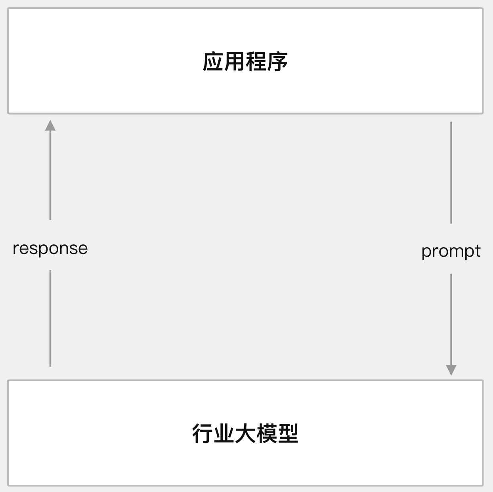
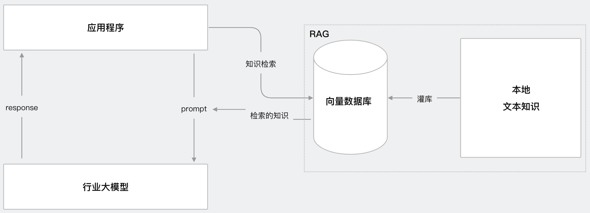
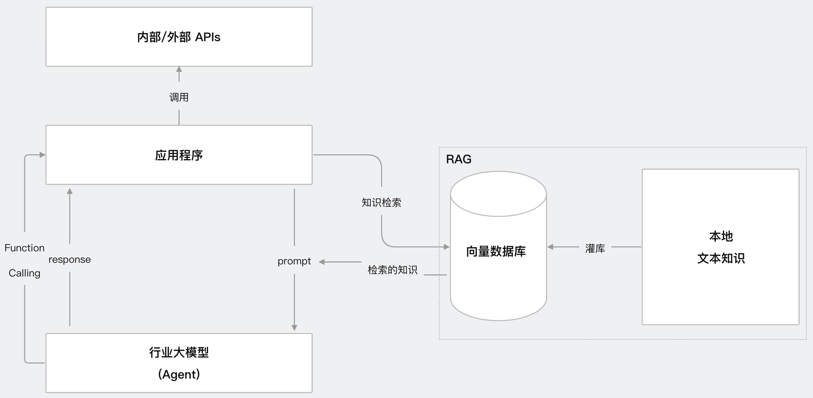
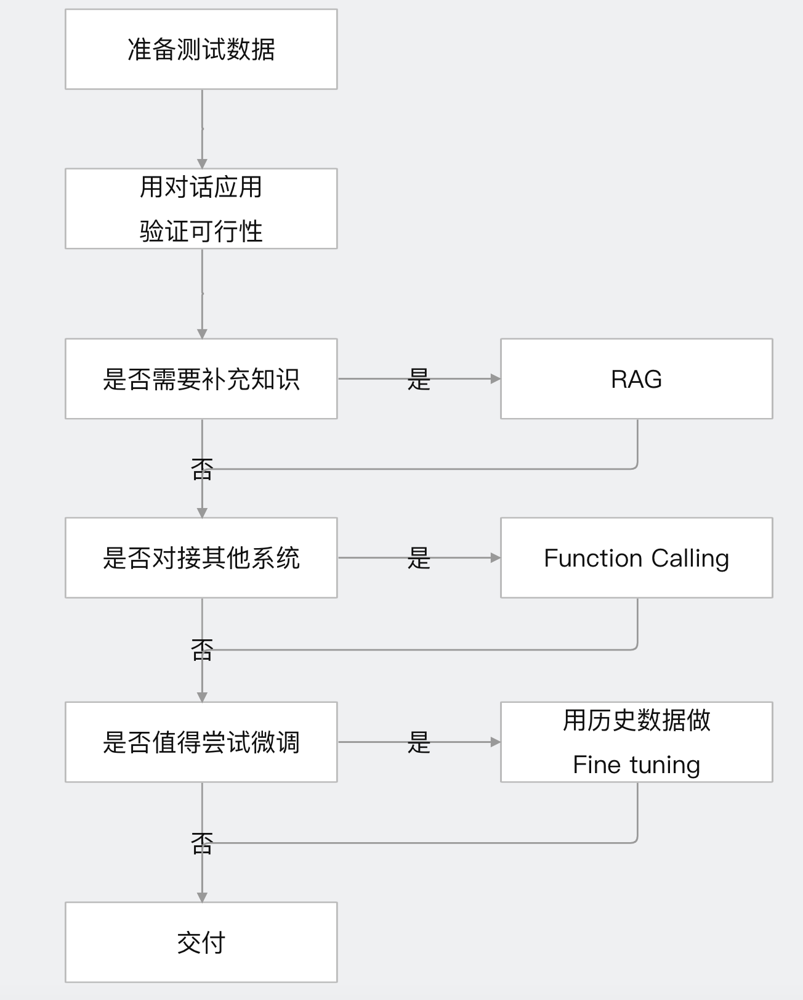

# 1、大模型应用开发基础
## 1.1 AGI是什么
Artificial General Intelligent                      
通用人工智能                    

## 1.2 大模型是什么      
大语言模型(LLM)                    
Large Language Model                          

## 1.3 AGI时代，新的社会分层
(1)AI使用者(人人都是，不稀缺)                
(2)AI产品开发者                   
(3)基础模型相关(门槛高、机遇难)                         

## 1.4 AGI核心能力模型
3懂:           
(1)懂业务:懂用户、客户、需求、市场、运营、商业模式                     
(2)懂AI:知道AI能做什么，不能做什么，怎样做更快、更好、更便宜                        
(3)懂编程:实现一个符合业务需求的产品                 

## 1.5 目前AGI行业共识
2个确定、1个不确定                
(1)确定未来:AI必然重构世界                       
(2)确定进入:想获取红利，必须马上进入                     
(3)不确定落地:解决什么问题，用什么技术路线，产品策略是什么，确定性都不高                           

## 1.6 AGI场景落地思路
(1)从最熟悉的领域入手               
(2)找“文本进、文本出”的场景                    
(3)别求大而全。将任务拆解。先解决任务小场景                 
(4)让AI学最厉害员工的能力，辅助其他员工，降本增效                

## 1.7 LLM如何生成结果
通俗原理:其实，TA只是根据上下文，猜下一个词(的概率)                
略深点的通俗原理:训练和推理是大模型工作的两个核心过程(用人类比，训练就是学，推理就是用。学以致用)             
用不严密但通俗的语言描述训练和推理:                    
**(1)训练**                                
大模型阅读了人类说过的所有话。这就是机器学习                  
训练过程会把说过的话中的不同token同时出现的概率存入神经网络文件，保存的数据就是参数，也叫权重                     
**(2)推理**                                     
给推理程序若干token(prompt)，程序会加载大模型权重算出概率最高的下一个token是什么                  
用生成的token再加上上下文，就能继续生成下一个token                      

## 1.8 AI，什么是AI 
主流观点:基于机器学习、神经网络是AI，基于规则、搜索的不是AI                
 
## 1.9 token是什么
prompt的单位            
(1)可能是一个英文单词，也可能是半个，三分之一个                       
(2)可能是一个中文词或一个汉子、半个汉子、甚至三分之一汉子                              
(3)大模型在开训前，需要先训练一个tokenizer模型，将所有文本切成token                                   

## 1.10 LLM生成机制的内核        
深度学习模型架构:Transformer、RWKV、Mamba                           
其中Transformer架构，仍是主流，但已经不是最先进的了，谷歌开源、最流行，几乎所有大模型都用它                               
目前只有Transformer被证明了符合scaling-law(深度学习领域的一种经验法则)                          

## 1.11 用好AI的核心心法
把AI当人看                 

## 1.12 大模型应用业务架构
(1)AI Embedded模式，人主导，中间某个环节AI参与，如人脸识别                 
(2)AI Copilot模式，AI和人主导，每个环节AI辅助参与                 
(3)AI Agent模式，人都事情丢给AI，AI自己规划自己去做                   
目前，Agent还太超前，Copilot值得追求                    

## 1.13 大模型应用技术架构
4种主流技术架构   应用技术特点:门槛低、天花板高                 
**(1)提示工程  prompt Engineering**                          
使用场景:知识问答、情报分析、写作、编程、文本加工等        
核心思想:构造一个有效且正确的prompt:指令具体、信息丰富、尽量少歧义             
技术架构图如下:    
         

**(2)给大模型新知识  RAG**                              
使用场景:智能知识库、智能诊断、数字分身、带例子的prompt等                    
核心思想:人找知识，会查资料；LLM找知识，会查向量数据库(向量检索即相似度检索)                               
技术架构图如下:                   
         
此时，prompt会带着问题和知识交给大模型，大模型基于知识进行总结反馈给应用程序              

**(3)让大模型对接外界   Function Calling**                                
使用场景:智能助手，下一代搜索引擎、机器人、Agent等                                    
基本过程:大模型调用内外部工具处理问题               
Agent使用json格式反向提出要求，应用了大模型的规则性原理            
技术架构图如下:         
         

**(4)让大模型深度理解知识  Fine-tuning**                                      
使用场景:智能知识库、智能诊断、数字分身等                                    
核心思想:人阅读背诵，理解资料；LLM进行增强学习训练                  
基本过程:给基础大模型增加参数(补充垂直领域的新知识)，基于大模型进行微调。Fine-tuning全过程都在使用工具(不需要重新造轮子)                           
技术架构图如下:      
           

与RAG解决的场景类似，差别:                        
RAG查询完资料就会忘记，下次需要重新再查                       
行业大模型(Fine-tuning)是将知识记住，可立即给结果                       
类比:一场开卷考试两种方案                   
方式1:RAG会查资料，节省算力                         
方式2:Fine-tuning要记住资料，消耗一定算力                          

## 1.13 如何选择技术路线
面对一个需求如何开始，如何选择技术方案。常用思路如下:             
          

前两步是最重要的，耗时最高           
值得尝试Fine-tuning的情况:             
(1)提高模型输出的稳定性              
(2)用户量大，降低推理成本的意义很大        
(3)提高大模型的生成速度          
(4)需要私有化部署