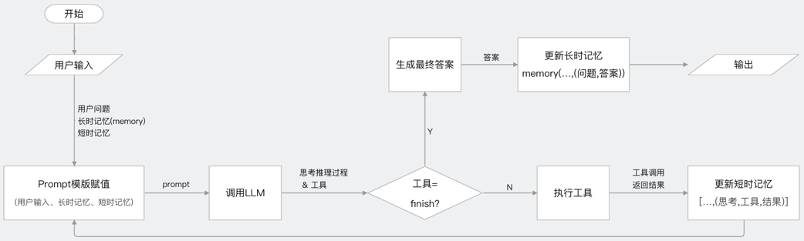

# 1、Agent基础概念
**Agent的定义**            
Agent 是具备自主性和目标导向的系统组件，它能够接收输入、处理数据，并基于特定规则或目标采取行动。它可以是一个独立的实体，能够根据环境的变化作出响应。          
在人工智能和自然语言处理领域，Agent通常被设计为能够接收用户请求、分析意图、调用外部工具或服务，并提供响应的模块。               

# 2、吴恩达推荐的4种Agent设计规范          
Reflection:反思。类似于AI的自我纠错和迭代，如AI系统会检查自己的编写的代码，并提出修改建议             
Tool USE:工具使用。大语言模型调用插件，扩展了其能力。如Copilot，进行联网搜索或调用代码插件解决数理逻辑           
planning:规划。AI根据用户输入的任务，拆解流程、选择工具、调用执行并输出结果。如根据一张图片中的姿态生成一张新图片并进行描述                   
Multi-Agent:多智能体协作。多个Agent协作完成任务，每个Agent可能扮演不同的角色，如CEO、产品经理、程序员等。这种模式模拟了现实生活中的工作场景，能够处理复杂系统                

# 3、Agent核心模块流程图                      
                                                            

# 4、能够完成Agent能力的大模型要求
关键能力：强大的自然语言处理能力、上下文记忆与保持、任务执行能力、以及调用外部工具或API的能力              

# 5、Agent开发框架
本项目系列教程为使用CrewAI+FastAPI搭建多Agent协作应用并对外提供API服务案例分享,大家可以按照如下顺序进行观看                                    
注意: 每个文件夹对应一个应用案例，案例详情进入该文件夹参考应用的README.md中内容               
(1)【Agent应用案例1-基础】使用CrewAI+FastAPI打造多Agent协作应用并对外提供API服务，支持gpt、通义千问、Ollama本地大模型对比测试                   
对应工程文件夹为:crewaitest                  
https://www.bilibili.com/video/BV1N44reDEt3/?vd_source=30acb5331e4f5739ebbad50f7cc6b949                  
https://youtu.be/2TE5DlYlvGw                  

(2)【Agent应用案例2-进阶】技术研究员智能体案例，Agent支持调用外部工具实现将生成的报告保存至PDF文件并下载至本地，CrewAI+FastAPI打造多Agent协作应用并对外提供API服务              
对应工程文件夹为:crewAIWithResearcher                   
https://www.bilibili.com/video/BV1Sy4HeiEBn/?vd_source=30acb5331e4f5739ebbad50f7cc6b949               
https://youtu.be/MGEdzUUKISw              

(3)【Agent应用案例3-进阶】健康档案助手智能体案例，Agent调用外部工具使用RAG，CrewAI+FastAPI打造多Agent协作应用并对外提供API服务              
https://www.bilibili.com/video/BV1j94oe7ESy/?vd_source=30acb5331e4f5739ebbad50f7cc6b949                 
https://youtu.be/YYxgE4i7-OE                   

(4)【Agent应用案例4-进阶】多个Agent协作完成高效软件编码，CrewAI+FastAPI打造多Agent协作应用并对外提供API服务                  
https://www.bilibili.com/video/BV1cNtJeJEPA/?vd_source=30acb5331e4f5739ebbad50f7cc6b949                  
https://youtu.be/U_CzuyKNKkY                   

(5)【Agent应用案例5-进阶】让任务以JSON数据格式并最终任务以JSON格式输出，CrewAI+FastAPI打造多Agent协作应用并对外提供API服务                 
https://www.bilibili.com/video/BV1i5bAeAEWn/?vd_source=30acb5331e4f5739ebbad50f7cc6b949                    
https://youtu.be/w8uxBuVQVlg                       
         